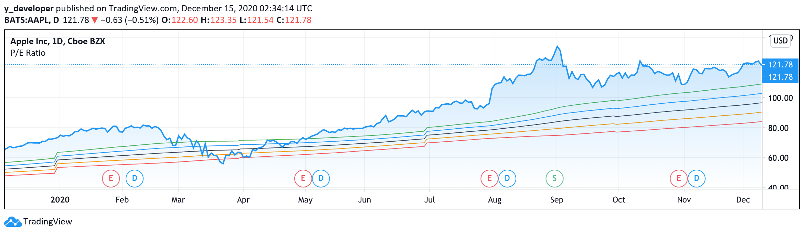

## 1. What is the P/E Ratio ?

The price-to-earnings ratio (P/E ratio) is the ratio for valuing a company that measures its current share price relative to its per-share earnings (EPS). The price-to-earnings ratio is also sometimes known as the price multiple or the earnings multiple.

P/E ratios are used by investors and analysts to determine the relative value of a company's shares in an apples-to-apples comparison. It can also be used to compare a company against its own historical record or to compare aggregate markets against one another or over time.

A high P/E ratio could mean that a company's stock is over-valued, or else that investors are expecting high growth rates in the future.

Companies that have no earnings or that are losing money do not have a P/E ratio since there is nothing to put in the denominator.

There are two kinds of P/E ratios, Trailing P/E and Forward P/E, are used in practice.

The trailing P/E relies on past performance by dividing the current share price by the total EPS earnings over the past 12 months. It's the most popular P/E metric because it's the most objective – assuming the company reported earnings accurately. The trailing P/E ratio will change as the price of a company’s stock moves, since earnings are only released each quarter while stocks trade day in and day out.

The forward (or leading) P/E uses future earnings guidance rather than trailing figures. Sometimes called "estimated price to earnings," this forward-looking indicator is useful for comparing current earnings to future earnings and helps provide a clearer picture of what earnings will look like – without changes and other accounting adjustments.

## 2. How to calculate P/E Ratio ?

To determine the P/E value, one simply must divide the current stock price by the earnings per share (EPS).

    

The current stock price (P) can be gleaned by plugging a stock’s ticker symbol into any finance website, and this concrete value reflects what investors must currently pay for a stock.

EPS comes in two main varieties. The first is a metric listed in the fundamentals section of most finance sites; with the notation "P/E (TTM)," where “TTM” is a Wall Street acronym for “trailing 12 months.” This number signals the company's performance over the past 12 months. The second type of EPS is found in a company's earnings release, which often provides EPS guidance. This is the company's best-educated guess of what it expects to earn in the future.

## 3. What does P/E Ratio tell you ?

The price-to-earnings ratio or P/E is one of the most widely-used stock analysis tools used by investors and analysts for determining stock valuation. In addition to showing whether a company's stock price is overvalued or undervalued, the P/E can reveal how a stock's valuation compares to its industry group or a benchmark like the S&P 500 Index.

The P/E ratio shows what the market is willing to pay today for a stock based on its past or future earnings. A high P/E could mean that a stock's price is high relative to earnings and possibly overvalued. Conversely, a low P/E might indicate that the current stock price is low relative to earnings. 

A high P/E suggests that investors are expecting higher earnings growth in the future compared to companies with a lower P/E. A low P/E can indicate either that a company may currently be undervalued or that the company is doing exceptionally well relative to its past trends. When a company has no earnings or is posting losses, in both cases P/E will be expressed as “N/A.” Though it is possible to calculate a negative P/E, this is not the common convention.

## 3. Tradingview Pine Script - P/E Ratio River

### · Step One: Initial Setting

    //@version=4
    study("P/E Ratio", overlay = true)

(1) Since we are not using the P/E Ratio as a tool for our stock trading, we start with the study function instead of strategy.

(2) With study function, we have one parameters to set up.

(3) We set overlay to be true to place the P/E Ratio graph in the same window.

### · Step Two: Parameter Setting
   
    eps = financial(syminfo.tickerid, "EARNINGS_PER_SHARE", "TTM")
    pe = close/eps
    pe_avg = sma(pe, 200)
    pe_std = stdev(pe, 200) 

    pe_avg_river = pe_avg * eps 
    pe_std_river_1 = pe_avg * eps + 1* pe_std
    pe_std_river_2 = pe_avg * eps + 2 * pe_std
    pe_std_river_3 = pe_avg * eps - 1* pe_std
    pe_std_river_4 = pe_avg * eps - 2* pe_std
    
(1) We first locate all earning per share through the past 12 months.

(2) The first line will give us all historical earnings that a stock has gained.

(3) We calculate the P/E Ratio by dividing the current close price by the earnings per share.

(4) That’s how we calculate the P/E Ratio with the most intuitive way.

(5) "pe_avg equals sma pe and 200" means we calculate the simple moving average of the P/E Ratio for the last 200 days.

(6) "pe_std equals stdev pe and 200" means we calculate the standard deviation of the P/E Ratio for the last 200 days.

(7) Next, we set up values of five lines. 

(8) "pe_avg_river equals pe_avg times eps" is how we calculate the first line by mulitple average P/E Ratio and earnings per share.

(9) Similarly, we calculate the next four lines by add or minus one or two times the standard deviation of P/E ratio from average P/E ratio.

### · Step Three: Plotting

    plot(pe_avg_river, color = color.black) 
    plot(pe_std_river1, color = color.blue)
    plot(pe_std_river2, color = color.green)
    plot(pe_std_river3, color = color.orange)
    plot(pe_std_river4, color = color.red)

(1) Now let’s plot what we have just calculated. 

(2) We first plot the pe_avg_river line. Plot brackets pe slash avg slash river comma color equals color dot black means we will be plotting pe_avg_river line in black.

(3) Similarly, we plot pe_std_river1 line in blue, pe_std_river2 line in green, pe_std_river3 line in orange and pe_std_river4 line in red .

The curve looks like the following:

